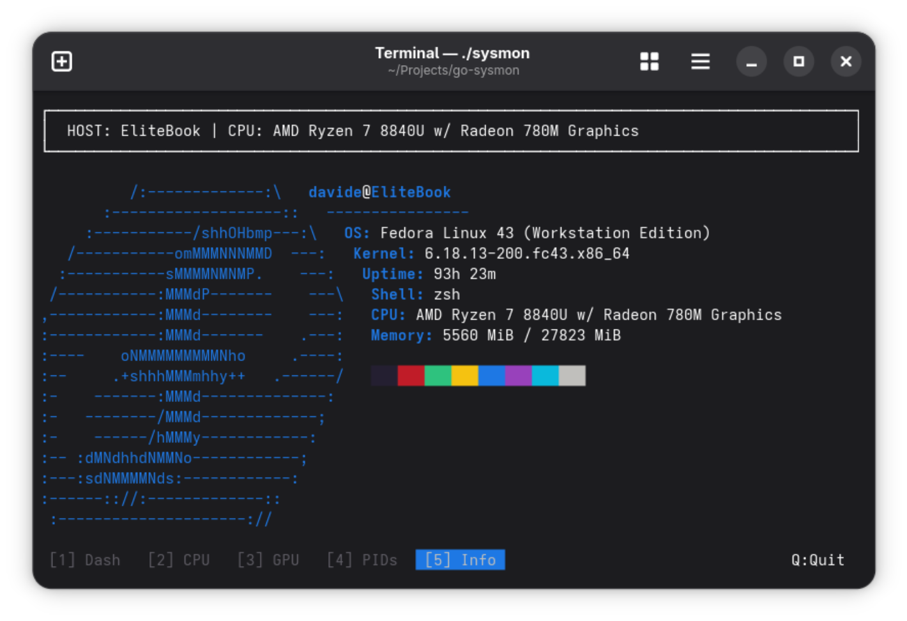

# 🚀 Go-Sysmon: Advanced Terminal System Monitor

[](https://goreportcard.com/report/github.com/DavyA/go-sysmon)
[](https://github.com/DavyA/go-sysmon/blob/main/go.mod)
[](https://opensource.org/licenses/MIT)

<p align="center">
  
</p>
A lightweight, high-performance terminal system monitor written in **Go**. Designed for developers and system administrators who want a clean, responsive, and efficient way to monitor their Linux systems without the overhead of heavy dependencies.



> [!NOTE] 
> This project was built from the ground up using raw ANSI escape codes and manual terminal state management, showcasing low-level system interaction and concurrent programming in Go.

---

## ✨ Key Features

- **📊 Real-time CPU Tracking**: Per-core usage monitoring with high-resolution historical graphs.
- **🌡️ Thermal & Power Monitoring**: Comprehensive dashboard for CPU/GPU temperatures, battery status, and total system power consumption.
- **🎮 GPU Insights**: Native support for **NVIDIA (NVML)** and open-source drivers (AMD/Intel), displaying model info, utilization, VRAM, and power draw.
- **🧠 Memory & Swap**: Precision monitoring of RAM and Swap usage.
- **🌐 Network Traffic**: Real-time ingress/egress speed monitoring per interface.
- **💀 Interactive Process Manager**: 
  - Full-featured PID view with interactive navigation.
  - Resource usage breakdown (CPU, Memory, GPU).
  - Ability to terminate processes directly from the TUI.
- **🖥️ Responsive TUI**: 
  - "Neofetch" meets "Archey" dashboard aesthetics with high-quality ASCII logos.
  - Flicker-free rendering using atomic string buffers (double-buffering).
  - Fast, responsive layout adaptation to terminal resizing.

---

## 🛠️ Technology Stack

- **Language**: Go (Golang)
- **Concurrency**: Heavy use of Goroutines and Channels for non-blocking data collection.
- **Low-Level**: Direct `ioctl` syscalls for terminal size detection and raw mode management.
- **Zero Dependencies**: Core logic relies on minimal external libraries, ensuring a tiny binary size.

---

## 🚀 Getting Started

### Prerequisites

- **OS**: Linux (tested on Ubuntu, Arch, Fedora)
- **Go**: 1.25.6 or higher (as per `go.mod`)

### Installation

```bash
# Clone the repository
git clone https://github.com/DavyA/go-sysmon.git
cd go-sysmon

# Build and run
go build -o sysmon
./sysmon
```

### Quick Run (via Go Install)
```bash
go install github.com/DavyA/go-sysmon@latest
```

---

## ⌨️ Controls

Navigate through different views using your keyboard:

| Key | Action |
|-----|--------|
| `1` | **Dashboard**: Overview of CPU, RAM, and History |
| `2` | **CPU View**: Detailed per-core monitoring |
| `3` | **GPU View**: Dedicated GPU statistics, model info, and graphs |
| `4` | **Process View**: Interactive PID list (Kill with `k`, Nav with `Arrows`) |
| `5` | **Info**: System summary and enhanced OS branding |
| `Q` | **Quit**: Cleanly restore terminal state and exit |

---

## 📈 Understanding the Process View

The **Process View (4)** is highly functional, allowing direct system management:

- **Navigation**: Use **Up/Down arrows** to select a process.
- **Termination**: Press **`k`** to send a SIGTERM to the selected process.
- **Resource Details**: See real-time Memory (RSS), CPU usage, and **GPU activity flags `[G]`**.
- **CPU% Metric**: CPU usage is reported as the percentage of a **single core's capacity**. 
  - *Example*: A process showing **100%** is fully utilizing one CPU core. On an 8-core system, a process can theoretically reach **800%**.

---

## 🏗️ Architecture Overview

The project follows a modular "Collector-Renderer" architecture:

1.  **Collectors**: Independent modules (`collector/`) gather system data using `/proc`, `sysfs`, and native GPU queries without external dependencies.
2.  **State Management**: A centralized, thread-safe `SystemState` aggregates data from various concurrent sources.
3.  **Flicker-Free Engine**: Implements a "double-buffering" approach where the entire frame is built in memory using `strings.Builder` and printed in a single atomic operation.
4.  **TUI System**: Custom rendering logic in `utils/render.go` handles ASCII art, colored bars, and adaptive layouts with interactive input handling.

---

## 🧪 Development & Contribution

I built this project to demonstrate performance-oriented Go development and bridge the gap between low-level OS internals and modern observability. Contributions, issues, and feature requests are welcome!

1. Fork the project.
2. Create your feature branch (`git checkout -b feature/AmazingFeature`).
3. Commit your changes (`git commit -m 'Add some AmazingFeature'`).
4. Push to the branch (`git push origin feature/AmazingFeature`).
5. Open a Pull Request.

---

## 📄 License

Distributed under the MIT License. See `LICENSE` for more information.

---

**Built with ❤️ by [Davide](https://github.com/DavyA)**
